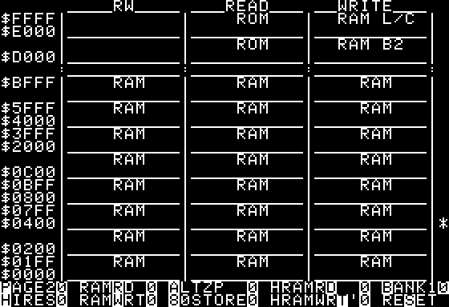

# Apple 2 Soft Switch

Inspired by Anthony's program here is a Applesoft BASIC program to display a memory map and limited soft switches.

# Commands

* ESC = exit
* SPC = toggle status lines to show description / soft-switch addresss

NOTE: The IO soft switch address don't exactly match the hardware switches due to:

a) some are contiguous
b) some require multiple locations to activate (i.e. TEXT/GR and Lo-Res/Hi-Res)

